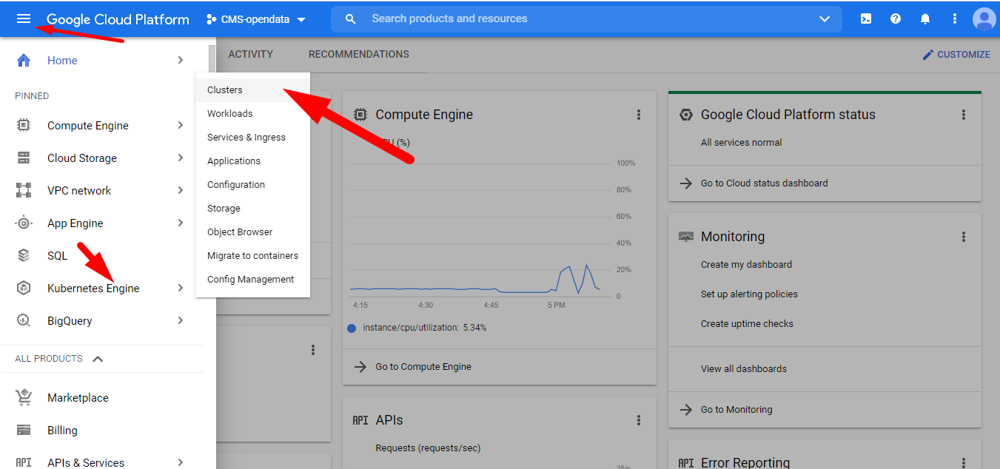
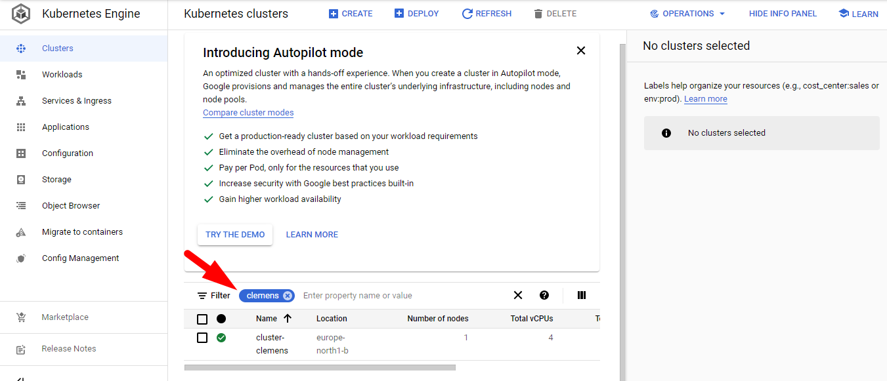
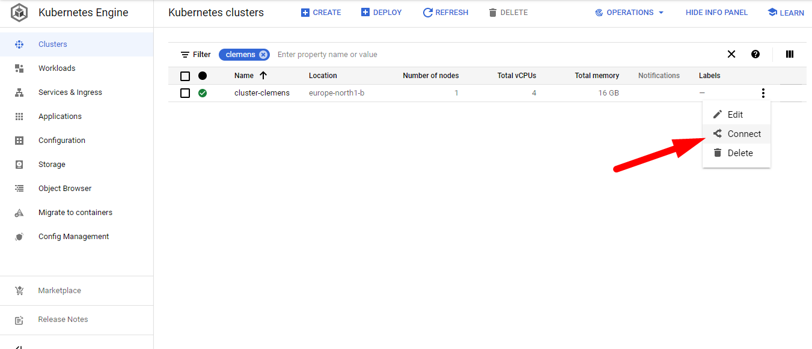

## Introduction

### Sign-in instructions

As it is possible to automate the process of creating resources in the cloud, we have built all the required resources for this tutorial in a GCP Project.

> Here you will find some [instructions on how to join this project](https://docs.google.com/presentation/d/1k-bSGGa7iOCRRgl7jLGrtYhI-M24GcvmUVJkkfRgXIQ/edit?usp=sharing), called `CMS-opendata`, on the GCP.  Please do follow that procedure in order for you to have access to your K8s cluster.
{: .testimonial}


### Your K8s cluster

Every one of you will have your own Kubernetes cluster already created. Remember we went through the trouble, yesterday, of creating the cluster by hand.  We did not even finish because all the needed elements require some time (and knowledge) to be set up.  The good news is that we have taken care of that for you.

Your cluster contains all the *toys* that you need to run some analysis workflow and extract the output.  The most relevant are the access to a an abstraction of disk space, called *pvc* (persistent volume claim), and an http fileserver that will allow you to access from outside the files you will be producing in this disk.  Also, some processes (in pods), which belong to this tool called `Argo` that we mentioned yesterday, are also running already on your cluster.  This will allow you to execute *workflows* for your analysis.

Each participant has a special `ID` consisting from the first 7 letters of the participant's email `[0-9a-z]`.  All the resources you will see later reflect this fact:

> ## Resources
>
>
>> -  gce-nfs-disk-<b>&lt;ID&gt;</b>
> {: .prereq}
>
>
>> ## cluster-<b>&lt;ID&gt;</b> (namespace "argo")
>> - Deploymet/Service: nfs-server-<b>&lt;ID&gt;</b>
>> - Deploymet/Service: http-fileserver-<b>&lt;ID&gt;</b>
>> - Deploymet/Service: argo-server-<b>&lt;ID&gt;</b>
>> - PV/PVC: nfs-server-<b>&lt;ID&gt;</b>
> {: .prereq}
{: .callout}

For example, `jo.hn2000@cern.ch` has a `cluster-john200` in the namespace `argo` and a process called `nfs-server-john200` running on his cluster.

> Remember, namespaces are reservations inside a K8s cluster.  Argo gets installed within the `argo` name space.  Other than that, this will not influence our work in any visible way.
{: .testimonial}


---

## Connect to your cluster

First, notice, by looking at the top of your web browser, that you are already in the GCP `CMS-opendata` project.

To connect to your cluster we are going to use the GCP CloudShell. Head to GCP > Kubernetes Engine > Clusters:



---

> ## Remember
> You can always use the filter with your ID to list only your resources
>
> 
{: .discussion}

---

Find your cluster, press connect and choose **RUN IN CLOUD SHELL** at the emerging window. Then hit enter to execute the `gcloud` command that will connect you to your cluster.

Press `Authorize` if prompted to do so.




## Getting to know your cluster

Let's go to the Cloud Shell terminal and run some `kubectl` commands to verify that all the different resources are actually running on your cluster.

> If you get disconnected from the terminal, just hit the Reconnect button.
{: .testimonial}

Check the pods that are running under the namespace `argo`:  

```bash
kubectl get pods -n argo
```

> If you forget the namespace declaration, `-n argo`, you will get null results.  This is because all the elements were created under this namespace (with the exception of the `pv`, which is not namespaced).
{: .testimonial}

~~~
NAME                                       READY   STATUS    RESTARTS   AGE
argo-server-edgarfe-64444f4574-brq7d       1/1     Running   2          10h
http-fileserver-edgarfe-5f8468d9fb-nvljz   1/1     Running   0          10h
minio-edgarfe-58ff684dbd-bbt5t             1/1     Running   0          10h
nfs-server-edgarfe-7ccc5c5fb8-gtbwb        1/1     Running   0          10h
postgres-6b5c55f477-5hqkj                  1/1     Running   0          10h
workflow-controller-7fb47d49bb-6l6wc       1/1     Running   2          10h
~~~
{: .output}

Note that there are two instances of the `argo-server` and its `workflow-controller`.  This is, we presume, to make sure there is always this service available to listen and deal with the requested workflows the client might request.

Now, let's check the persistent volume, `pv`, that was created globally (it is not namespaced) as an abstraction for the disk storage infrastructure:

```bash
kubectl get pv
```

~~~
NAME          CAPACITY   ACCESS MODES   RECLAIM POLICY   STATUS   CLAIM              STORAGECLASS   REASON   AGE
nfs-edgarfe   100Gi      RWX            Retain           Bound    argo/nfs-edgarfe   standard                12h
~~~
{: .output}

Our workflows will be *claiming* this persistent volume through a `persistent volume claim`, `pvc`, that has been also created for us in our `argo` namespace.  Let's check:

```bash
kubectl get pvc -n argo
```

~~~
NAME          STATUS   VOLUME        CAPACITY   ACCESS MODES   STORAGECLASS   AGE
nfs-edgarfe   Bound    nfs-edgarfe   100Gi      RWX            standard       10h
~~~
{: .output}

The *Bound* STATUS reflects the fact that is linked to the `pv`.  A `pvc` can be claiming all the disk space available in the `pv` or only a fraction of it.  In this case, we are claiming the whole disk: 100Gi.

> Take note of the *NAME* of the `pvc` as this will need to be referenced when trying to write to the disk it is linked to.  Make sure you replace the name of the examples in this tutorial with the name of your own pvc.
{: .testimonial}

Check the services running and the associated IP addresses:

```
kubectl get svc -n argo
```

~~~
NAME                          TYPE           CLUSTER-IP       EXTERNAL-IP     PORT(S)                      AGE
argo-server-edgarfe           LoadBalancer   10.122.199.159   34.88.193.217   2746:30307/TCP               10h
http-fileserver-edgarfe       LoadBalancer   10.122.206.111   35.228.53.183   80:32703/TCP                 10h
minio-edgarfe                 ClusterIP      10.122.201.144   <none>          9000/TCP                     10h
nfs-server-edgarfe            ClusterIP      10.122.206.212   <none>          2049/TCP,20048/TCP,111/TCP   10h
postgres                      ClusterIP      10.122.202.183   <none>          5432/TCP                     10h
workflow-controller-metrics   ClusterIP      10.122.199.13    <none>          9090/TCP                     10h
~~~
{: .output}

> Take note of the `EXTERNAL-IP` address for the `http-fileserver` as this is the address you will point your browser to in order to access any output files written to the mounted volumes.
{: .testimonial}

You can point your browser to this IP address right now.  You will find a familiar but empty tree structure.  Your files will arrive there if written to the volumen(s) mounted with the `pvc`:


> ## To remember
>
> When exposing a server like this, with a public IP address, you get charged on GCP for the outgoing and incoming traffic.
{: .discussion}

> Also take note of the `EXTERNAL-IP` address for the `argo-server`..
{: .testimonial}

If you point your browser to that IP address, formatted in this way **https://34.88.193.217:2746** (replace your own IP; the port is always 2746), you will get access to the `Argo` GUI.  It is a nice application to monitor you workflows.  We will check it out later.


Do not mind the `minio` and the `postgres` processes, they come with the setup, but we are not going to use them.  


